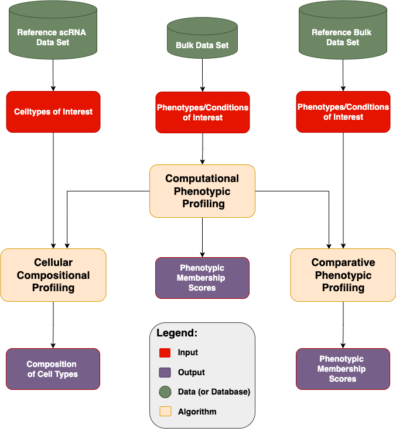

# Dprofiler:
Comparative Profiling Platform for Diseases, Phenotypes and Experimental Conditions

# Introduction

Biospecimen collected from multiple sources of experimental and technical conditions often exhibit
**diverse molecular profiles and patterns.** Each individual sample presents an additional source of information towards elucidating
biological mechanisms, and each sample may even be more informative than the differential expression between phenotypic conditions

Understanding complex patterns of expression profiles are essential to solving diseases, and such knowledge can only be generated by
using advanced statistical measures and methods that are capable of computationally modeling and
**separately investigating molecular profiles of each sample.**

## Dprofiler

To deciphering these complex molecular profiles within gene expression datasets, we have developed **Dprofiler.**

This application computationally profiles a set of targeted samples by connecting them to reference expression datasets with phenotypic profiles of interest.
Building on these reference profiles of phenotypic groups, Dprofiler evaluates bulk RNA samples, detect possibly existing anomalies and heterogeneities,
and further explores causes and sources of distinct molecular patterns with the aid of single cell maps and other reference gene expression datasets.

Users are allowed to use a variety of algorithms to calculate a **Membership Score** of samples associated to some phenotypic profiles of interest.
Dprofiler derives reference phenotypic profiles from submitted datasets, cell-types of single cell maps and conditions from external gene expression data sets.
Membership scores are universally interpretable, and indicate the similarity of a sample to these reference profiles.

<p align="center">
  
</p>


Dprofiler offers multiple capabilities using these three components:

- **Computational Profiling:** Scoring and Profiling submitted samples using homogeneouos subpopulations of phenotypic reference profiles within the same dataset.
- **Cellular Composition Analysis:** Infering the cellular composition of each scored sample with a reference scRNA data and estimate fractions of cellular compositions.
- **Comparative Profiling:** Scoring and Profiling samples using targeted phenotypic profiles of a reference bulk expression data set.

Dprofiler is based on a recently developed Shiny (R) application, 
[DEBrowser](https://www.bioconductor.org/packages/release/bioc/html/debrowser.html), 
an interactive tool for DE analysis and visualization. DEBrowser incorporates 
[DESeq2](https://bioconductor.org/packages/release/bioc/html/DESeq2.html) 
(Love et al., 2014),
[EdgeR](https://bioconductor.org/packages/release/bioc/html/edgeR.html)
(Robinson et al., 2010), and
[Limma](https://bioconductor.org/packages/release/bioc/html/limma.html)
(Ritchie et al., 2015) coupled with
shiny (Chang, W. et al., 2016)  to produce real-time changes within your
plot queries and allows for interactive browsing of your DE results.
DEBrowser also manipulates your results 
in a way that allows for interactive plotting by which changing padj or fold change limits 
also changes the displayed graph(s). For more details about Dprofiler, please
visit our quick start guide for some helpful tutorials, and please also visit 
[UMMS-Biocore/debrowser](https://github.com/UMMS-Biocore/debrowser) for more information
on DEBrowser. 

# Quick start

Before you start; you will have to install R and/or RStudio. 

```
# Installation instructions:
# 1. Install DEBrowser and its dependencies by running the lines below
# in R or RStudio.

  if (!requireNamespace("remotes", quietly=TRUE))    
    install.packages("remotes")
  remotes::install_github("UMMS-Biocore/dprofiler")

# 2. Load the library

library(dprofiler)

# 3. Start Dprofiler

startDprofiler()
```